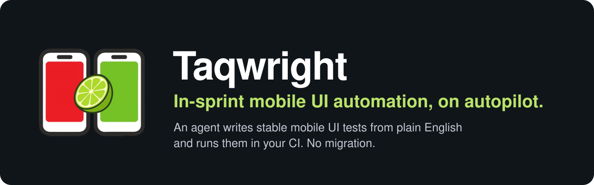

<p align="center">
  <a href="https://www.taqwright.ai">
    
  </a>
</p>

<p align="center">
  <a href="https://www.npmjs.com/package/@taqwright/lime-cli"></a>
  <a href="https://www.npmjs.com/package/@taqwright/lime-agent"></a>
  
  
</p>

<p align="center">
  <a href="https://www.taqwright.ai">Website</a> ·
  <a href="https://www.taqwright.dev">Taqwright framework</a> ·
  <a href="https://www.taqwright.ai/pricing">Book a demo</a> ·
  <a href="mailto:support@taqwright.ai">support@taqwright.ai</a>
</p>

## How it works

<table>
  <tr>
    <td width="33%" valign="top">
      <br>
      <strong>Describe the journey</strong><br>
      <em>"Log in, add a dress to the cart, check out."</em>
    </td>
    <td width="33%" valign="top">
      <br>
      <strong>LIME drives a real device</strong><br>
      Android or iOS, on your machine or in the cloud, and records stable locators, never coordinates.
    </td>
    <td width="33%" valign="top">
      <br>
      <strong>A pull request lands</strong><br>
      The test joins your suite and runs in CI like any other.
    </td>
  </tr>
</table>

## Why teams use it

- **Fits the suite you already have.** Bring your own Appium framework and cloud devices.
- **Stable by design.** Accessibility ids and anchored locators, so a test replays on another device.
- **Visual checks.** AI visual regression catches what an assertion would miss.

## Get started

```bash
# connect the devices on your machine
npm install -g @taqwright/lime-agent

# turn a goal into a test from your terminal or CI
npm install -g @taqwright/lime-cli
```

Access is by request. [Book a demo](https://www.taqwright.ai/pricing) and we'll set your team up.

---

<p align="center">
  <a href="https://www.taqwright.ai">www.taqwright.ai</a> · <a href="mailto:support@taqwright.ai">support@taqwright.ai</a>
</p>
